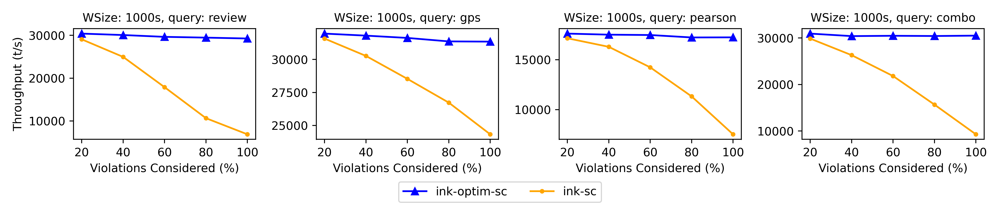

# COSQA: Consistency-Aware Continuous Query Answering

This application allows to perform consistency-aware query answering through three implementations (NCOSQAGraph, NCOSQAList, and KCOSQA classes) realized on top of Kafka Streams. 
A fourth implementation without consistency awareness (NI classes) is included in the repo. 
A streaming-adapted, database Baseline implementation is located in [this](https://anonymous.4open.science/r/INCA-39D4/) repository.

## Experiments 

### Qualitative (preliminary)

In the following, we report a qualitative study that we performed on an aggregate query that calculates the sum of the prices of a given Stock. 
We analysed 4 (+1) different approaches for dealing with inconsistencies derivated by two speed constraints applied over the stream, i.e., SC1 and SC2.
In our scenario, _we consider inconsistent the exclusive violation of either SC1 or SC2, but not the simultaneous violation of both_.
The 4 approaches are:

- `filter`: a database-inspired solutions where inconsistent records are simply filtered out of the stream, thus undersampling the aggregate
- `song`: a solution derived from [1], where is performed a repair operation over streams with respect to Speed Constraints
- `groundtruth`: is the actual groundtruth
- `ninc`: no inconsistency management is performed
- `inkstream`: our approach

All 4 approaches are reproduced using our framework, demonstrating its potential in terms of inconsistency management. 
In particular, we used the information contained within the polynomials annotations to filter out events (`filter`) or to readjust the value (`song`).
In our approach (`inkstream`), we also readjusted the value, but we were also able to _ignore the simultaneous violation of SC1 and SC2_, resulting in a result that is nearer to the `groundtruth`.


### Performances

The experiments were performed using Java 17.0.2 and built through Maven 3.8.1. 
On top of this, it is necessary to download Apache Kafka 3.1.0.
Once everything is downloaded, startup Apache Kafka environment, first Zookeeper
```
KAFKA_DIR/bin/zookeeper-server-start.sh KAFKA_DIR/config/zookeeper.properties
```
then, the Kafka Broker (the default configuration is fine if the experiments are run locally).
```
KAFKA_DIR/bin/kafka-server-start.sh KAFKA_DIR/config/server.properties
```

Build the Maven project
```
cd cosqa
mvn clean
mvn install
mvn package
```


Run the following script to create and populate Kafka topics, where `nrecords` is the number of records inside each topic (datasets are replicated if the number exceeds the dataset max quantity of records), and `DATASET_DIR` is the local dataset directory, which can be downloaded from this [link](https://drive.google.com/file/d/1ntZWqej8tuG0JeZLKH5cV-dlPjvuQyR2/view?usp=share_link).
```
.PROJECT_DIR/scripts/populate-topics.sh nrecords DATASET_DIR KAFKA_DIR
```


Run the following script to start the experiments, where `nrecords_to_process` are the number of records that each query needs to process in each experiment, and `RESULTS_DIR` is the directory where to put the results.

```
.PROJECT_DIR/scripts/cosqa-run-experiments.sh RESULTS_DIR nrecords_to_process granularity
```
This other script runs KCOSQA experiments
```
.PROJECT_DIR/scripts/kcosqa-process.sh RESULTS_DIR nrecords_to_process granularity
```
NOTE: `granularity` is a debug parameter, and it should always be bigger than `nrecords_to_process` when running the experiments. 

The baseline experiments can be executed through the `run-inca.sh` script, with the same argument as the previous two scripts (keep in mind that the baseline is far slower, thus it is reasonable to use a reduced number of events).

In the following, the performance results in terms of throughput, time percentage with respect to annotation and consumption overhead, and scalability with respect to the number of constraints used and number of inconsistencies detected.



<p align="center">
    
</p>


